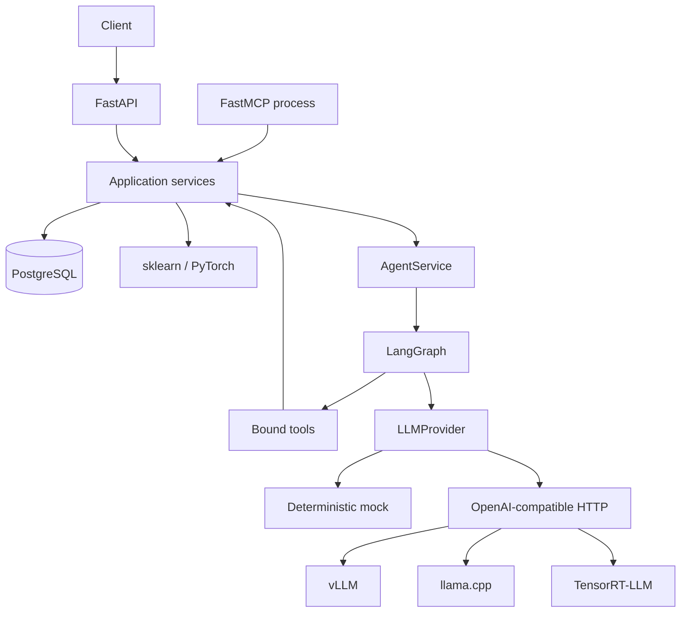

# Architecture

Модульный монолит объединяет предметную модель, SQLAlchemy, классификаторы и orchestration. FastAPI и MCP — транспортные входы. `runtime.py` создаёт зависимости и управляет их временем жизни; ни router, ни LLM не создают соединения к БД самостоятельно.



## POST /api/v1/tickets/{id}/analyze

```mermaid
sequenceDiagram
    participant Client
    participant API as FastAPI / AgentService
    participant Graph as LangGraph
    participant Service as TicketService / DB
    participant LLM as LLMProvider
    Client->>API: POST analyze
    API->>Graph: ainvoke(ticket_id, run_id)
    Graph->>Service: get_ticket
    Service-->>Graph: snapshot + version
    Graph->>Service: classify_ticket
    Service-->>Graph: category + probabilities
    Note over Graph: assess_priority + conditional edge
    opt Complex ticket and context enabled
        par Customer context
            Graph->>Service: customer_context
        and Related tickets
            Graph->>Service: similar_tickets
        end
    end
    Graph->>LLM: prompt + trusted facts
    LLM-->>Graph: draft JSON or backend error
    Note over Graph: validate / fallback; override factual fields
    Graph->>Service: persist result if version unchanged
    Service-->>Graph: committed agent run
    Graph-->>API: typed result
    API-->>Client: 200 + run_id + warnings
```

## Границы модулей

- `tickets`: DTO и domain rules; `TicketService` владеет транзакциями бизнес-операций.
- `database`: mapping и конкретный `TicketRepository`; нет generic repository framework.
- `classical_ml`, `deep_learning`: обучение в CLI, inference через общий structural Protocol.
- `llm`: transport-independent request/response, mock, HTTP implementation, LangChain bridge.
- `agent`: graph state и orchestration; tools делегируют service.
- `observability`: native SDK context managers за небольшим общим контрактом.

Каждая операция service открывает короткую session. На время LLM generation БД-транзакция не удерживается. Два параллельных tools получают разные sessions. DTO сериализуется до закрытия session; relationship `lazy='raise'` обнаруживает непредусмотренный SQL, `selectinload` загружает predictions явно.

Анализ не является одной транзакцией: classification prediction может сохраниться до последующей ошибки LLM/graph. Финальная запись `agent_runs` и изменение priority атомарны. Если ticket изменён за время анализа, финальная запись отвергается с 409. API не обещает exactly-once: повторный analyze создаёт новый run и prediction. Checkpointer по умолчанию отсутствует.

## Ошибки

| Ситуация | Результат |
|---|---|
| Некорректная request schema | 422, стандартная валидация FastAPI |
| Ticket отсутствует | 404 |
| Конфликт версии | 409 |
| Нет обученной модели | 503 |
| Ошибка БД | 503 с безопасным сообщением; детали в log |
| LLM timeout / backend unavailable / invalid JSON | Отмеченный human-review fallback внутри graph |
| Общий deadline graph | 504 |
| Неожиданная programming error | Логируется, не подменяется успешным ответом |

## Questions to answer after reading this code

1. Где заканчивается ответственность router и начинается service?
2. Почему LLM-вызов не находится внутри DB transaction?
3. Что произойдёт, если пользователь изменит ticket между generation и persist?
4. Какие данные могут остаться после неуспешного graph run?
5. Почему отдельный MCP process не превращает каждый package в микросервис?
