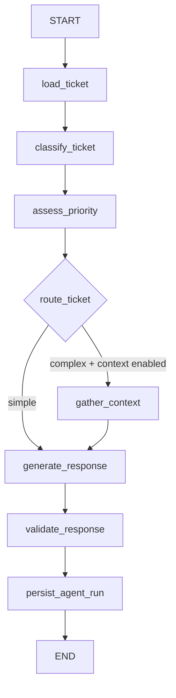

# LangGraph guide

Файлы: `agent/state.py`, `tools.py`, `nodes.py`, `graph.py`, `service.py` внутри `src/ai_support_lab/`.

## State входит → node возвращает delta

`AnalysisState` — TypedDict с ключами ticket_id, run_id, ticket, classification, priority, context, raw_response и result. Узлы не мутируют переданный dict: возвращают новые поля. Ключи обновляются overwrite-семантикой; reducers здесь не нужны, поскольку нет параллельных graph-веток, которые одновременно пишут в один ключ.

`gather_context` выполняет asyncio tasks внутри одного node. Это отличается от graph fan-out: node возвращает один объединённый context. У каждого service call собственная session. При ошибке соседние tasks отменяются и ожидаются до выхода.

Router выбирает `context`, когда priority high/critical или score ниже 0.6 и пользователь разрешил context. Иначе выбирается `simple`. Он возвращает label edge, не изменяет state и не вызывает nodes сам.

## Tool и node

Node — шаг graph, работающий со state. Tool — typed capability, которую можно вызвать независимо; здесь LangChain `@tool` оборачивает обычный service. Graph вызывает `.ainvoke({})` у привязанных tools. ID закреплён closure текущего run, поэтому LLM не выбирает произвольные DB rows.

Основной workflow управляется приложением: это bounded agent workflow, а не свободный ReAct-loop. Настоящий remote tool calling показан отдельно в `llm/native_langchain.py`: ChatOpenAI.bind_tools, разбор tool_calls, ToolMessage, with_structured_output. Этот пример не пишет в БД и ограничен одним read-only tool round.

## LangChain без лишних слоёв

`generate_response` собирает ChatPromptTemplate, format instructions от PydanticOutputParser и runnable chain `prompt | chat_model | StrOutputParser`. `ProviderChatModel` — адаптер BaseChatModel над нашим LLMProvider. Mock и remote HTTP получают одинаковые messages.

Финальная validation сначала требует полный JSON через Pydantic: это не позволяет partial JSON parser молча исправить обрезанный ответ. Затем LangChain parser материализует LLMDraft. Category/priority и score берутся из classifier/policy, ID — из request/DB. Text draft остаётся рекомендацией, а не выполненным действием.

## Ошибки и persistence

Backend unavailable, backend timeout или malformed completion envelope дают fallback. Неверный JSON draft также даёт fallback: requires_human=true, used_fallback=true, warnings с причиной. Полный graph имеет отдельный timeout и возвращает 504, если deadline исчерпан.

`persist_agent_run` сохраняет анализ только при неизменившейся версии ticket. Начальная классификация — отдельная transaction и может остаться после ошибки следующего шага. Запуск анализа не закрывает ticket.

## Checkpointing

`build_graph` принимает optional InMemorySaver. Тест `test_node_and_checkpoint_history` вызывает graph с thread_id и читает `aget_state_history`. Default API не держит неограниченную историю в памяти процесса. InMemorySaver теряется при restart; это не durable execution. Для resume понадобятся durable saver и идемпотентность side effects. Простое возобновление текущего persist может повторить write.

Graph сейчас ациклический. Retry/review edge может создать цикл; вместе с ним нужны лимит шагов, termination policy и контроль повторных side effects.

## Questions to answer after reading this code

1. Что является state и что возвращает node?
2. Как router выбирает edge?
3. Чем node отличается от tool?
4. Чем asyncio.gather внутри node отличается от graph fan-out?
5. Где нужны reducers при параллельных обновлениях state?
6. Почему checkpointer сам не гарантирует exactly-once?
7. Где мог бы возникнуть бесконечный цикл?
8. Какие поля LLM не может переопределить и почему?
9. Чем прямой service call проще orchestration через graph?
